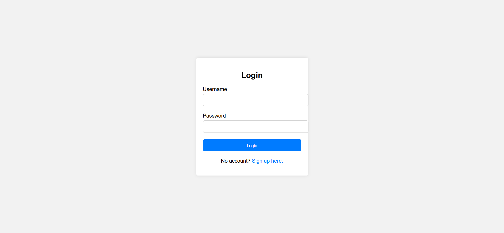

# COOKBOOK COMPASS DESIGN DOCUMENT

## Purpose
The purpose of this document is to provide comprehensive technical specifications and architecture details for the development of the dynamic recipe website. It will serve as the blueprint while developing the website.

## Scope
* Website Pages
  * Home Page
  * Search Results Page
  * Registration and Login Page
  * Recipe Information Page
  * Profile Page
* Website Functions
  * View Recipes
  * Search recipes
  * Filter recipe search results
  * View recipe details
  * Play embedded recipe videos (If available)
  * User registration
  * User Login and authentication
  * Save favorite recipes
  * View listed favorite recipes
  * Edit user profile

## Architecture
* Frontend Tech Stack:
   * HTML, CSS, and JavaScript (ES6+): The core technologies for building the website's structure, style, and functionality.
   * React: A JavaScript library for building user interfaces, particularly useful for its efficient updating and rendering of the right components when data changes.

* Backend Tech Stack:
   * Node.js: A runtime environment that allows you to run JavaScript on the server.

* Database:
   * MySQL: A relational database management system for storing user information, recipe details, and other relational data efficiently.

* Storage:
   * Amazon S3 (Simple Storage Service): For storing and retrieving any amount of data at any time, such as images and videos for recipes. This service provides scalability, data availability, security, and performance.

* Version Control & Hosting:
   * Git: For version control, allowing multiple developers to work together and manage changes to the project codebase.
   * GitHub: A hosting service for Git repositories that also provides access control, bug tracking, feature requests, task management, and CI/CD pipelines.

## Interfaces
* User Interfaces
   * Home Page: Features a clean and intuitive design with a search bar, featured recipes, and categories for easy navigation.
   * Search Results Page: Displays recipes in a grid or list view with thumbnails, titles, and brief descriptions. Includes filters for refining search results.
   * Recipe Detail Page: Shows detailed recipe information including ingredients, preparation steps, images, and video tutorials. Offers a "favorite" button for registered users.
   * Registration/Login Page: Simple and secure forms for user registration and login. Includes social login options for convenience.
   * Profile Page: Allows users to view and edit their profile information, manage their favorite recipes, and access customization settings.

* External Interfaces:
   * APIs for Recipe Data: Integration with third-party APIs to fetch recipe data, ingredients, and cooking instructions. This allows for a rich and diverse database of recipes.

## My SQL Database tables

* Table Name: Users
  * Description: Stores information about registered users of the website.
  * Columns:
     * id (INT, Primary Key, Auto-Increment): Unique identifier for each user.
     * first_name (VARCHAR): User's first name.
     * last_name (VARCHAR): User's last name.
     * email (VARCHAR, Unique): User's email address. Used for login and notifications.
     * password (VARCHAR): Hashed password for secure authentication.

* Table Name: Recipes
  * Description: Contains details of recipes available on the website.
  * Columns:
     * id (INT, Primary Key, Auto-Increment): Unique identifier for each recipe.
     * name (VARCHAR): Name of the recipe.
     * ingredients (TEXT): List of ingredients required for the recipe.
     * instructions (TEXT): Step-by-step instructions for preparing the recipe.
     * video_url (VARCHAR, Nullable): URL of a video tutorial for the recipe (optional).
     * image (VARCHAR): URL or path to the recipe's image.

* Table Name: Favorites
  * Description: Manages the relationship between users and their favorite recipes.
  * Columns:
     * user_id (INT, Foreign Key): References id in the Users table. Identifies the user who favorited a recipe.
     * recipe_id (INT, Foreign Key): References id in the Recipes table. Identifies the recipe that was favorited.
  * Note: This table acts as a many-to-many relationship table between Users and Recipes, allowing users to favorite multiple recipes and recipes to be favorited by multiple users.

* Relationships:
  * Users to Favorites: One-to-Many (One user can have many favorite recipes, but each favorite entry belongs to one user).
  * Recipes to Favorites: One-to-Many (One recipe can be favorited by many users, but each favorite entry is associated with one recipe).
  
* Indexes and Constraints:
  * Primary Keys: Used on the id column in each table to uniquely identify rows.
  * Foreign Keys: Used in the Favorites table (user_id and recipe_id) to enforce referential integrity with the Users and Recipes tables.
  * Unique Constraints: Applied to the email column in the Users table to ensure no two users can register with the same email address.

## Use Cases

### Homepage
1. User Lands on Homepage
 - Primary Actor: User
 - Preconditions: None
 - Main Flow: The user navigates to the website's URL and is presented with the homepage, featuring a welcoming interface.
 - Postconditions: The user views the homepage with various options, including featured recipes, search bar, and categories.

2. User Views Featured Recipes
 - Primary Actor: User
 - Preconditions: User is on the homepage.
 - Main Flow: The user scrolls through a section showcasing selected recipes chosen for their popularity, seasonality, or culinary interest.
 - Postconditions: The user can click on any featured recipe to view its details.

3. User Uses Search Bar to Search Recipes
 - Primary Actor: User
 - Preconditions: User is on the homepage.
 - Main Flow: The user types a keyword into the search bar and initiates a search.
 - Postconditions: The website displays a list of recipes matching the search criteria.

4. User Clicks on Recipe Category to Browse Recipes
 - Primary Actor: User
 - Preconditions: User is on the homepage.
 - Main Flow: The user selects a category from a list of predefined options (e.g., Vegan, Breakfast, Quick Meals).
 - Postconditions: The website displays recipes belonging to the chosen category.

### Search
1. User Enters Keyword in Search Bar
 - Primary Actor: User
 - Preconditions: User is on any page with access to the search bar.
 - Main Flow: The user inputs a search term related to their interest (e.g., "chicken curry").
 - Postconditions: The website processes the search and displays relevant recipes.
2. User Views List of Recipes with Matching Keywords
 - Primary Actor: User
 - Preconditions: User has entered a keyword in the search bar.
 - Main Flow: The website displays a list or grid of recipes that match the search criteria.
 - Postconditions: User can browse through the list of recipes.
3. User Applies Filters to Refine Search Results
 - Primary Actor: User
 - Preconditions: User has searched for a recipe and views the results.
 - Main Flow: The user applies various filters (e.g., cuisine, ingredients) to narrow down the search results.
 - Postconditions: The website updates the list of recipes based on the selected filters.
4. User Clicks on Recipe Card to View Recipe Details
 - Primary Actor: User
 - Preconditions: User is viewing a list of recipes.
 - Main Flow: The user selects a recipe by clicking on its card.
 - Postconditions: The website navigates to the detailed recipe page.

### View Recipe Details
1. User Views Detailed Recipe Page
 - Primary Actor: User
 - Preconditions: User has selected a recipe to view.
 - Main Flow: The user is presented with a page containing the recipe's ingredients, instructions, cooking time, and an image or video.
 - Postconditions: User can read and follow the recipe.
2. Logged in User Saves Recipe to Favorites
 - Primary Actor: Logged in User
 - Preconditions: User is logged in and viewing a recipe detail page.
 - Main Flow: The user clicks on a button to save the recipe to their favorites.
 - Postconditions: The recipe is added to the user's favorites list, accessible from their profile.

### Registration & Login
1. Guest User Clicks Register and Fills Sign Up Form
 - Primary Actor: Guest User
 - Preconditions: User is not logged in and views the registration page.
 - Main Flow: The user fills in the registration form with necessary information and submits it to create a new account.
 - Postconditions: The user's account is created, and they are logged in to the website.
2. Registered User Enters Credentials and Clicks Login
 - Primary Actor: Registered User
 - Preconditions: User has an account and is on the login page.
 - Main Flow: The user enters their login credentials and initiates the login process.
 - Postconditions: The user is authenticated and gains access to their account and profile.

### User Profile
1. Logged in User Clicks on Profile Icon
 - Primary Actor: Logged in User
 - Preconditions: User is logged in.
 - Main Flow: The user clicks on the profile icon or menu option to access their profile page.
 - Postconditions: The user views their profile page with personal information, favorites, and settings.
2. User Views and Edits Their Information
 - Primary Actor: Logged in User
 - Preconditions: User is on their profile page.
 - Main Flow: The user selects an option to edit their profile information and submits the changes.
 - Postconditions: The user's profile information is updated.
3. User Views List of Their Favorited Recipes
 - Primary Actor: Logged in User
 - Preconditions: User is on their profile page.
 - Main Flow: The user navigates to the favorites section to view a list of recipes they have saved.
 - Postconditions: User can browse and select any favorite recipe to view its details.
4. User Removes Recipes from Their Favorites
 - Primary Actor: Logged in User
 - Preconditions: User is viewing their list of favorited recipes.
 - Main Flow: The user selects and removes recipes from their favorites.
 - Postconditions: The selected recipes are removed from the user's favorites list.
5. User Logs Out from Dropdown Menu
 - Primary Actor: Logged in User
 - Preconditions: User is logged in and wishes to log out.
 - Main Flow: The user selects the logout option from a dropdown menu or profile page.
 - Postconditions: The user is logged out and redirected to the homepage or login page.

