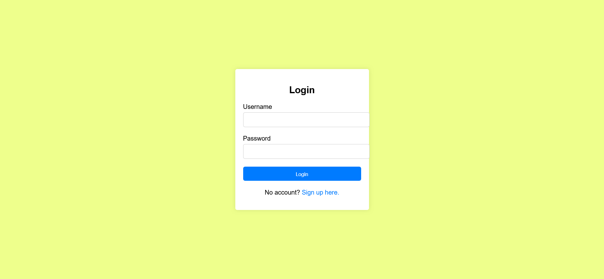
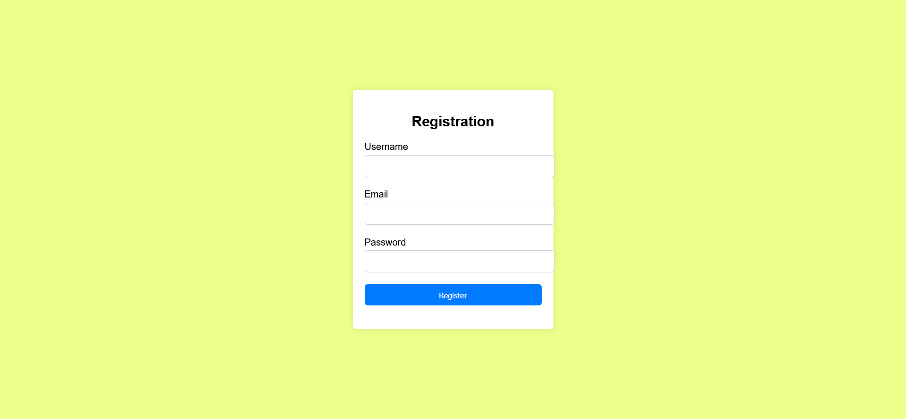

# COOKBOOK COMPASS DESIGN DOCUMENT

## Purpose
The purpose of this document is to provide comprehensive technical specifications and architecture details for the development of the dynamic recipe website. It will serve as the blueprint while developing the website.

## Scope
* Website Pages 
  * Home Page
  * Search Results Page
  * Registration and Login Page
  * Recipe Information Page
  
* Website Functions
  * View Recipes
  * Search recipes
  * View recipe details
  * Play embedded recipe videos (If available)
  * User registration
  * User Login and authentication

## Architecture
* Frontend Tech Stack:
   * HTML, CSS, and JavaScript (ES6+): The core technologies for building the website's structure, style, and functionality.
  
* Database:
   * MySQL: A relational database management system for storing user information, recipe details, and other relational data efficiently.

* Version Control:
   * Git: For version control, allowing multiple developers to work together and manage changes to the project codebase.

## Interfaces
* User Interfaces
   * Home Page: Features a clean and intuitive design with a search button and featured recipes.
   * Search Results Page: Displays recipes in a grid or list view with thumbnails, titles.
   * Recipe Detail Page: Shows detailed recipe information including ingredients, preparation steps, images, and video tutorials(if available).
   * Registration/Login Page: Simple and secure forms for user registration and login.

* External Interfaces:
   * APIs for Recipe Data: Integration with third-party APIs to fetch recipe data, ingredients, and cooking instructions. This allows for a rich and diverse database of recipes.

## My SQL Database tables

* Table Name: Users
  * Description: Stores information about registered users of the website.
  * Columns:
     * id (INT, Primary Key, Auto-Increment): Unique identifier for each user.
     * user_name (VARCHAR): User name.
     * email (VARCHAR, Unique): User's email address. Used for login and notifications.
     * password (VARCHAR): Hashed password for secure authentication.

* Indexes and Constraints:
  * Primary Keys: Used on the id column in users table to uniquely identify rows.
  * Unique Constraints: Applied to the email column in the Users table to ensure no two users can register with the same email address.

## Use Cases

### Homepage
1. User Lands on Homepage
 - Primary Actor: User
 - Preconditions: None
 - Main Flow: The user navigates to the website's URL and is presented with the homepage, featuring a welcoming interface.
 - Postconditions: The user views the homepage with various options, including featured recipes, search button.
 - Requirement: The welcoming interface aligns with the requirement for the homepage to display a header, featured recipes, search button, and categories - Functional Requirement - 2.1 (Homepage).

2. User Views Featured Recipes
 - Primary Actor: User
 - Preconditions: User is on the homepage.
 - Main Flow: The user scrolls through a section showcasing selected recipes chosen for their popularity, seasonality, or culinary interest.
 - Postconditions: The user can click on any featured recipe to view its details.
 - Requirement: Showcasing selected recipes meets the requirement for the homepage to feature appealing recipes - Functional Requirement - 2.2 (Homepage).

3. User uses Search Button to login/signup
 - Primary Actor: User
 - Preconditions: User is on the homepage.
 - Main Flow: User will be navigated to login page or registration page on clicking the search button. 
 - Postconditions: User can login using username and password.
 - Requirement: The search button functionality directly corresponds to the requirement for allowing users to login/signup from the homepage - Functional Requirement - 2.3 (Homepage).

4. User uses Search button to search recipe
 - Primary Actor: User
 - Preconditions: User is logged in.
 - Main Flow: User will be navigated to search page on clicking search button. 
 - Postconditions: User can search for recipes in search bar.
 - Requirement: The search functionality directly corresponds to the requirement for allowing users to find any recipe from the search page - Functional Requirement - 2.4 (Homepage).

Flow chart:

Mockup:

### Search
1. User Enters Keyword in Search Bar
 - Primary Actor: User
 - Preconditions: User is on search page.
 - Main Flow: The user inputs a search term related to their interest (e.g., "chicken curry").
 - Postconditions: The website processes the search and displays relevant recipes.
 - Requirement: Entering a keyword and viewing search results aligns with the requirement for users to be able to view a grid/list of recipes based on a search - Functional Requirements 3.1 (Search results page).

2. User Views List of Recipes with Matching Keywords
 - Primary Actor: User
 - Preconditions: User has entered a keyword in the search bar.
 - Main Flow: The website displays a list or grid of recipes that match the search criteria.
 - Postconditions: User can browse through the list of recipes.
 - Requirement: Displaying recipes matching the search criteria fulfills the requirement for recipe cards showing relevant information - Functional Requirements 3.2 & 3.3(Search Results Page).

3. User Clicks on Recipe Card to View Recipe Details
 - Primary Actor: User
 - Preconditions: User is viewing a list of recipes.
 - Main Flow: The user selects a recipe by clicking on its card.
 - Postconditions: The website navigates to the detailed recipe page.
 - Requirement: This use case is a direct match with the requirement to display detailed information on the recipe information page - Functional Requirements 5 (Recipe Information Page).

4. User is shown a message on entering an incorrect search query
 - Primary Actor: User
 - Preconditions: User is on search page.
 - Main Flow: The user inputs an incorrect search term.
 - Postconditions: An error message will show up.
 - Requirement: Entering an incorrect keyword and hitting search will display a "no results found" message, this directly corresponds to requirement - Functional Requirements 3.4 (Search results page).

5. User can search via clicking on magnifying glass icon or by hitting the enter button
 - Primary Actor: User
 - Preconditions: User is on search page.
 - Main Flow: The user inputs a search term related to their interest (e.g., "chicken curry") and clicks magnifying glass or enter button on 
   keyboard.
 - Postconditions: The website processes the search and displays relevant recipes.
 - Requirement: Search query should run on clicking the magnifying glass icon or hitting the enter button - Functional Requirements 3.5, 3.6 (Search results page).

Flow chart:

Mockup:

### View Recipe Details
1. User Views Detailed Recipe Page
 - Primary Actor: User
 - Preconditions: User has selected a recipe to view.
 - Main Flow: The user is presented with a page containing the recipe's ingredients, instructions, cooking time, and an image or video if 
   available.
 - Postconditions: User can read and follow the recipe.
 - Requirements: Viewing the detailed recipe page covers the requirements for displaying images, ingredients, instructions, and cooking videos - Functional Requirements 5.1, 5.2, 5.3 (Recipe Information Page).

Flow Chart:

Mockup:

### Registration & Login
1. Guest User Clicks Register and Fills Sign Up Form
 - Primary Actor: Guest User
 - Preconditions: User is not logged in and views the registration page.
 - Main Flow: The user fills in the registration form with necessary information and submits it to create a new account.
 - Postconditions: The user's account is created, and they are logged in to the website.
 - Requirement: This use case meets the requirement for users to be able to register for a new account - Functional Requirement 4(4.1,4.2,4.3)(User Authentication).

2. Registered User enters Credentials and Clicks Login
 - Primary Actor: Registered User
 - Preconditions: User has an account and is on the login page.
 - Main Flow: The user enters their login credentials and initiates the login process.
 - Postconditions: The user is authenticated and gains access to their account and profile.
 - Requirement: The login process fulfills the requirement for registered users to be able to login securely - Functional Requirements 1(User Authentication).

3. Registered User enters invalid email id
 - Primary Actor: Registered User
 - Preconditions: User has an account and is on the login page.
 - Main Flow: The user enters an invalid email id and initiates the login process.
 - Postconditions: An error message appears and the user cannot login until they enter a valid email.
 - Requirement: Error message should appear on entering an email in incorrect format - Functional Requirements 1.4 (User Authentication).

4. Registered User enters incorrect password
 - Primary Actor: Registered User
 - Preconditions: User has an account and is on the login page.
 - Main Flow: The user enters an incorrect password and initiates the login process.
 - Postconditions: An error message appears and the user cannot login until they enter the correct password
 - Requirement: Error message should appear on entering incorrect password - Functional Requirements 1.5 (User Authentication).

5. Registered User does not enter email id or password
 - Primary Actor: Registered User
 - Preconditions: User has an account and is on the login page.
 - Main Flow: The user does not enter email or password and initiates the login process.
 - Postconditions: An error message appears and the user cannot login until they enter both email and password.
 - Requirement: Error message should appear on submitting the form without entering either email or password - Functional Requirements 1.6 (User Authentication).

6. Guest User enters invalid email id
 - Primary Actor: Guest User
 - Preconditions: User is not logged in and views the registration page.
 - Main Flow: The user enters invalid email id and submits the form.
 - Postconditions: An error message appears and the user cannot submit the form until they enter a valid email.
 - Requirement: Error message should appear on entering an email in incorrect format - Functional Requirement 4.4 (Registration).

7. Guest User enters invalid password
 - Primary Actor: Guest User
 - Preconditions: User is not logged in and views the registration page.
 - Main Flow: The user enters a weak password and submits the form.
 - Postconditions: An error message appears and the user cannot submit the form until they enter a strong password.
 - Requirement: Error message should appear on entering a password that is not strong - Functional Requirement 4.5 (Registration).

8. Guest User submits the registration form without filling any details.
 - Primary Actor: Guest User
 - Preconditions: User is not logged in and views the registration page.
 - Main Flow: The user submits a form without entering any details.
 - Postconditions: An error message appears and the user cannot submit the form without entering valid details for all required fields.
 - Requirement: User should not be able to submit the registration form without entering valid details for all required fields - Functional Requirement 4.6 (Registration).

Flow Charts:

Mockups:

